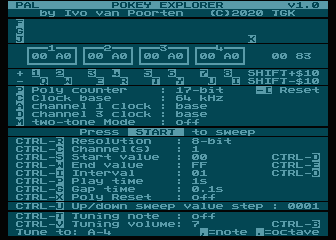

POKEY EXPLORER
==============

Pokey Explorer is a tool to explore all possible register combinations of the Atari 8-bit Pokey chip.

TL;DR All INVERSE video characters are keys you can press. Some with SHIFT to go a little faster. By pressing START, you start a sweep determined by the sweep settings.

All values are hexadecimal. Basic understanding of how Pokey works is assumed :)

SOME SORT OF MANUAL
-------------------

There are four rectangles that contain the current values of all AUDF and AUDC registers. The channel number is on top. AUDF is on the left side. AUDC is on the right side.

Below are two lines with INVERSE video characters that indicate which keys you can press to influence the values. The upper line keys increase the value by one, and the lower line keys decrease the value by one. If you hold shift, you can increase or decrease the specific value by $10 (16).

To the right of the four rectangles are two hexadecimal values. The first is AUDCTL. The second is SKCTL. Both can be influenced by a lot of keys that are described below.

**F** and **G** toggle the filter bits.

**J** and **K** toggle the join channels bits.

**P** toggles the poly counter between 17-bit and 9-bit.

**C** toggles the base clock frequency between 15kHz and 64kHz.

**A** and **D** toggle the clock for channel 1 and 3 respectively, between the base clock and 1.79MHz.

**M** enables/disables two-tone mode. The only key that influences SKCTL.

Pressing **-** (minus) or **\[** resets the poly counter by storing a non-zero value to STIMER.

Automated Sweeps
----------------

By pressing **START**, you can start an automated sweep of either an 8-bit value or 16-bit value. The settings are described below.

**CTRL-R** Selects the **R**esolution. 8-bit, 16-bit or reverse 16-bit, where the LSB and MSB are swapped.

**CTRL-C** Selects the **C**hannels that are sweeped. Depending on the resolution, it's either 1, 2, 3, 4, or relevant 16-bit pairs, which are 1+2, 3+4, 1+3 and 2+4.

**CTRL-S** and **CTRL-D** Increase and decrease the start value of the sweep. See CTRL-U.

**CTRL-W** and **CTRL-E** Increase and decrease the end value of the sweep. See CTRL-U.

**CTRL-I** and **CTRL-O** Increase and decrease the interval, i.e. step size during the sweep. See CTRL-U.

**CTRL-P** Selects how long the tone is heard. 0.1s, 1s, 2s or 4s.

**CTRL-G** Selects the length of the silent pause between each tone. 0s, 0.1s, 0.5s or 1s.

**CTRL-X** Selects whether the poly counter is reset by writing a non-zero value to STIMER. Can be off, once (at the start of the sweep), or each (each new tone).

**CTRL-U** Selects the step size for increasing and decreasing sweep values. This can greatly reduce the time to reach a value like $7654 :) Step size can be $0001, $0010, $0100 or $1000. The last two have no effect on the interval.
